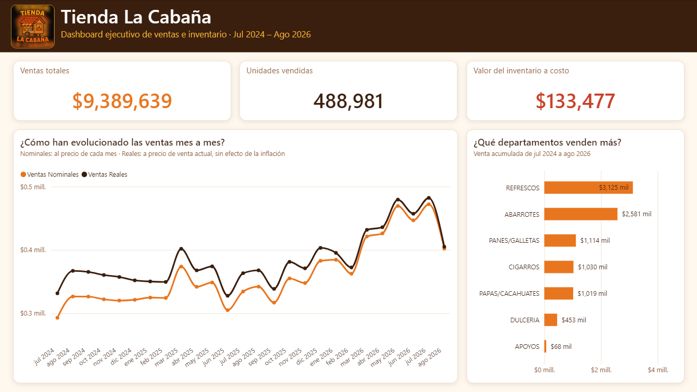
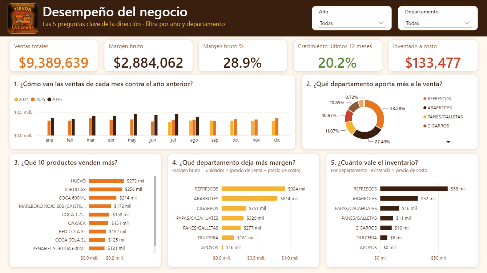

# Proyecto 1 – Tienda La Cabaña

Análisis de ventas e inventario de una tienda de abarrotes, construido de punta a punta: **Excel → MySQL → Power BI**.

## El problema

Tienda La Cabaña vende **1,004 productos** repartidos en **7 departamentos** (ABA abarrotes, APO, CIG cigarros, DUL dulces, PAN pan, PAP papas/cacahuates y REF refrescos). La información estaba dispersa en archivos de Excel mensuales, lo que hacía difícil responder preguntas básicas del negocio: ¿cuánto se vende?, ¿qué departamentos y productos pesan más?, ¿el negocio crece?, ¿cuánto dinero hay parado en inventario?

El objetivo fue ordenar esa información en una base de datos, cargarla de forma repetible cada mes y presentarla en un dashboard claro.

## Proceso: Excel → MySQL → Power BI

1. **Excel – limpieza y unificación.** Se unificaron las ventas de 26 meses (julio 2024 a agosto 2026) en un solo archivo de 16,483 filas y se limpiaron el catálogo de productos (1,004) y el inventario (799 productos con existencia). Solo se usan los 7 departamentos vigentes.
2. **MySQL – modelo y validaciones.** Tres tablas relacionadas (`productos`, `ventas`, `inventario`) con llaves primarias y foráneas, un script de validaciones y cuatro vistas para el dashboard.
3. **Power BI – dashboard.** Conexión a MySQL, modelo con tabla de calendario y 20 medidas DAX en español, y dos páginas de reporte.

## Carga mensual (3 cargas)

Cada mes se cargan tres archivos CSV, **siempre en este orden**: productos → inventario → ventas. Cada carga usa una *tabla de paso* (staging) y un procedimiento almacenado que solo mueve a la tabla final lo que es válido y deja en la tabla de paso lo que hay que revisar.

| Orden | Script | Tabla de paso | Procedimiento | Qué hace |
|---|---|---|---|---|
| 1 | `05_carga_productos.sql` | `carga_productos` | `sp_carga_productos` | Actualiza productos existentes y da de alta los nuevos (solo los 7 departamentos válidos). |
| 2 | `07_carga_inventario.sql` | `carga_inventario` | `sp_carga_inventario` | Suma las compras del mes a la existencia. |
| 3 | `06_carga_ventas.sql` | `carga_ventas` | `sp_carga_ventas` | Agrega las ventas del mes y descuenta lo vendido del inventario (nunca menos de 0). |

Rutina: importar el CSV a la tabla de paso con el Table Data Import Wizard → `CALL` del procedimiento → revisar que la tabla de paso quede vacía (lo que sobre son códigos o departamentos inválidos). Cada procedimiento corre dentro de una transacción. En `sql/` hay archivos CSV de ejemplo (septiembre 2026).

## Preguntas de negocio que responde el dashboard

- ¿Cuánto se ha vendido y cuántas unidades?
- ¿Cómo evolucionan las ventas mes a mes, y cómo se ven a precios actuales (ventas reales) frente a precios del mes (nominales), para quitar el efecto de la inflación?
- ¿Qué departamentos y qué productos generan más ventas (Top 10)?
- ¿Cuál es el margen bruto, en total y por departamento?
- ¿Cuánto crece el negocio frente al año anterior?
- ¿Cuánto dinero hay en inventario y en qué departamentos está?

## Indicadores principales (jul 2024 – ago 2026, 26 meses)

| Indicador | Valor |
|---|---|
| Ventas | $9,389,639 |
| Unidades vendidas | 488,981 |
| Margen bruto | $2,884,062 (28.9 %) |
| Crecimiento últimos 12 meses | +20.2 % |
| Inventario a costo | $133,477 |

## Dashboard

**Página 1 – Resumen ejecutivo**



**Página 2 – Desempeño del negocio**



## Estructura del proyecto

```
PROYECTO 1 - TIENDA LA CABANA/
├── sql/        scripts 01 a 07 (tablas, datos, validaciones, vistas, cargas) y CSV de ejemplo
├── excel/      PRODUCTOS, INVENTARIOS y VENTAS UNIFICADAS (datos limpios)
├── powerbi/    PROYECTO_TIENDA_LA_CABAÑA.pbix y logo
└── capturas/   imágenes del dashboard
```

Para reproducirlo: ejecutar en orden `01_crear_tablas.sql`, `02_cargar_datos.sql`, `03_validaciones.sql` y `04_vistas_powerbi.sql` en MySQL, y abrir el `.pbix` apuntando a la base `tienda`.

## Herramientas

Excel · MySQL / MySQL Workbench (tablas, vistas, procedimientos almacenados, transacciones) · Power BI Desktop (modelo de datos, DAX) · Claude (asistente de IA).

## Nota sobre los datos y sobre el uso de IA

- Los datos de **julio 2025 a agosto 2026 son reales**. Los de **julio 2024 a junio 2025 son simulados** (precios al 95 % de los actuales) para poder analizar comparativos año contra año; el inventario también es simulado.
- Yo definí las reglas de negocio, el diseño de la base de datos y las validaciones, y escribí las consultas básicas. Usé la IA como herramienta para los procedimientos almacenados, la limpieza masiva de datos y la construcción del dashboard, y revisé y probé todo el resultado.
